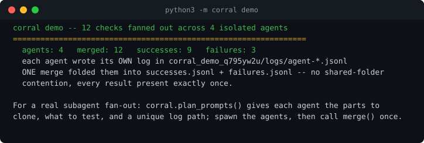

# corral

**Run many test agents over one sandbox, in isolation, and merge their results safely.**

Fan a large body of checks out across parallel agents — each agent clones only the parts it needs,
tests them in its own private workdir, writes its **own** log, and destroys its clone. When every
agent is done, a **single** merge step folds all the logs into one `successes.jsonl` /
`failures.jsonl` pair. **No two agents ever write the same file, and the shared results are written
by exactly one step** — so the many-agents-saving-to-one-folder corruption never happens.



```bash
python3 -m corral demo        # 15-second live tour: 12 checks across 4 isolated agents, merged once
```

## Why it exists

A naive fan-out has every agent append to the same results folder at once. Under real concurrency
that loses lines, interleaves them, or double-counts. corral makes that impossible by construction:

```
split_population   discover the work; split into N disjoint, balanced slices (never a typed list)
checkout           each agent copies ONLY its slice's parts into a private workdir
run_slice          the agent tests in isolation and writes agent-<id>.jsonl  (its own file)
merge              ONE writer, after the fan-out, folds every per-agent log into the shared files
```

Every result appears **exactly once**; a unit that raises becomes a logged failure, never a crash
of the run; repeated runs never lose or corrupt. All of this is proven under real thread
concurrency in `tests/test_corral.py`.

## Use it

```python
from corral import fanout

def work(unit, workdir):          # workdir is this agent's private clone (or None)
    ok = run_your_check(unit, workdir)
    return (ok, "what happened")

summary = fanout(
    population=discover_units(),   # a list; corral splits it into disjoint slices
    work_fn=work,
    n_agents=16,
    out_dir="runs/2026-09-23",
    prepare=lambda agent_id: checkout(SRC, parts_needed, f"/tmp/agent-{agent_id}"),
    teardown=cleanup,
)
# summary -> {"agents": 16, "merged": N, "successes": ..., "failures": ...}
# results -> runs/2026-09-23/successes.jsonl  and  failures.jsonl  (written once, by merge)
```

### With real subagents

`plan_prompts()` gives each agent, from the same disjoint slices, the parts to clone, what to test,
and a **unique** log path. Spawn the agents (any orchestrator), let each write its own log, then
call `merge()` once. The safety property is identical — the only shared write is the final merge.

## Install and run

No dependencies. No account. No network. Standard library only.

```bash
git clone <this repo> && cd corral
python3 -m corral demo
python3 -m unittest discover -s tests
```

## The safety properties, as tests

- **disjoint + complete + balanced** slices — no unit tested twice, none dropped.
- **isolation** — an agent's clone holds only its parts; it is destroyed after.
- **exactly-once merge** — under 16 concurrent agents over 200 units, every result appears once.
- **no shared write during the run** — the work function asserts the shared file does not exist yet.
- **a raising unit is a failure, not a crash.**
- **repeated runs never lose or corrupt** — totals grow by exactly N each run.
