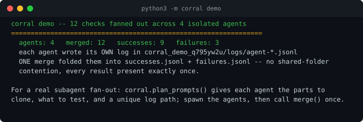

# sandbox-fan-out

**Run many test agents over one sandbox, in isolation, and merge their results without ever corrupting them.**

[](https://github.com/Cshearer210/sandbox-fan-out/actions/workflows/ci.yml)


Fan a large body of checks out across parallel agents. Each agent clones only the parts it needs,
tests them in its own private workdir, writes its **own** log, and destroys its clone. When every
agent is done, a **single** merge step folds all the logs into one `successes.jsonl` /
`failures.jsonl` pair. No two agents ever write the same file, and the shared results are written by
exactly one step — so the many-agents-saving-to-one-folder corruption cannot happen by construction.

The import/command name is `corral`; the project is `sandbox-fan-out`.



## Why it exists

A naive fan-out has every agent append to the same results folder at once. Under real concurrency
that loses lines, interleaves them, or double-counts — and the failure is silent, so a run looks
complete while results are missing. This library makes that impossible by separating the two things
that must never happen together: agents writing in parallel, and writing to a shared file.

```
split_population   discover the work; split into N disjoint, balanced slices (never a typed list)
checkout           each agent copies ONLY its slice's parts into a private workdir
run_slice          the agent tests in isolation and writes agent-<id>.jsonl  (its own file)
merge              ONE writer, after the fan-out, folds every per-agent log into the shared files
```

Every result appears **exactly once**; a unit that raises becomes a logged failure, never a crash of
the run; repeated runs never lose or corrupt. All of this is proven under real thread concurrency in
`tests/test_corral.py`.

## Limits, up front

Scope boundaries, so you know what this is and is not before you install:

- **It does not spawn agents for you.** The built-in `fanout()` runs your work function in-process
  with threads (deterministic, easy to test). For a real multi-process or subagent fan-out,
  `plan_prompts()` hands you one brief per agent — the parts to clone, the units to test, a unique
  log path — and **you** spawn them with your orchestrator of choice, then call `merge()` once.
- **Isolation is a file-copy clone, not an OS sandbox.** `checkout()` gives each agent only the
  files its slice needs; it separates *files*, not privileges, processes, or network. Use a
  container if you need true privilege isolation.
- **The local executor is threads** (GIL-bound). That is ideal for I/O-bound checks and for
  deterministic testing; it is not a route to CPU-bound parallelism. CPU-heavy work belongs on the
  real-subagent / multi-process path.
- **`merge()` dedupes by `(agent_id, unit)` and appends.** It assumes each agent wrote its own
  uniquely named log; that invariant is what `run_slice()` and `plan_prompts()` guarantee.

None of these are bugs — they are the boundary of the problem this solves: safe result-merging for a
fan-out, not the agent runtime itself.

## Install and run

No dependencies. No account. No network. Python standard library only.

```bash
pip install git+https://github.com/Cshearer210/sandbox-fan-out
corral doctor        # verify THIS install actually works -- 4 checks, exits non-zero on any failure
corral demo          # 15-second live tour
```

`corral doctor` is there because green CI tells you the *source* is fine and says nothing about the
copy that landed on your machine. It imports the installed package, checks every name it promises,
splits a population and asserts the slices are disjoint, then runs a real 7-unit fan-out across 3
agents and confirms each wrote its own log and the merge folded them exactly once. If your install
is half-finished, that is the command that says so.

Working on the library itself:

```bash
git clone https://github.com/Cshearer210/sandbox-fan-out && cd sandbox-fan-out
python3 -m unittest discover -s tests        # the full test suite
python3 -m corral demo                       # the module form still works everywhere `corral` does
```

## Use it

```python
from corral import fanout

def work(unit, workdir):          # workdir is this agent's private clone (or None)
    ok = run_your_check(unit, workdir)
    return (ok, "what happened")

summary = fanout(
    population=discover_units(),   # a list; the library splits it into disjoint slices
    work_fn=work,
    n_agents=16,
    out_dir="runs/2026-09-23",
    prepare=lambda agent_id: checkout(SRC, parts_needed, f"/tmp/agent-{agent_id}"),
    teardown=cleanup,
)
# summary -> {"agents": 16, "merged": N, "successes": ..., "failures": ...}
# results -> runs/2026-09-23/successes.jsonl  and  failures.jsonl  (written once, by merge)
```

### With real subagents

`plan_prompts()` gives each agent, from the same disjoint slices, the parts to clone, what to test,
and a **unique** log path. Spawn the agents (any orchestrator), let each write its own log, then call
`merge()` once. The safety property is identical — the only shared write is the final merge. See
[`examples/subagent_fanout.py`](examples/subagent_fanout.py).

## Demo

Real output from `python3 -m corral demo`:

```
corral demo -- 12 checks fanned out across 4 isolated agents
================================================================
  agents: 4   merged: 12   successes: 9   failures: 3
  each agent wrote its OWN log in corral_demo_ym_pe5pq/logs/agent-*.jsonl
  ONE merge folded them into successes.jsonl + failures.jsonl -- no shared-folder
  contention, every result present exactly once.

For a real subagent fan-out: corral.plan_prompts() gives each agent the parts to
clone, what to test, and a unique log path; spawn the agents, then call merge() once.
```

Score a run's merged results by verdict (the token before the first `:` in each note):

```bash
python3 -m corral scoreboard runs/2026-09-23
```

## How it works

- **`split_population(units, n_agents)`** — round-robins the discovered population into up to
  `n_agents` disjoint, balanced slices, dropping empty ones (fewer units than agents means fewer
  agents, never idle ones).
- **`checkout(src, parts, dest)` / `cleanup(dest)`** — build and tear down an agent's private clone
  holding only the parts its slice touches.
- **`run_slice(...)`** — runs one slice in isolation and writes exactly one per-agent log; a unit
  that raises is caught and logged as a failure, never a crash of the run.
- **`merge(...)`** — the single writer. After the fan-out, it folds every `agent-*.jsonl` into the
  shared `successes.jsonl` / `failures.jsonl`, deduping by `(agent_id, unit)`.
- **`fanout(...)`** — orchestrates split → run-every-slice → merge-once with a thread pool.
- **`plan_prompts(...)`** — the same disjoint slices as briefs for a real subagent fan-out.
- **`scoreboard` / `summarize(...)`** — reads a run's merged results back into a classified tally.

## Status

| Capability | Status |
|---|---|
| Disjoint / balanced / complete slicing | ✅ works today — tested |
| Per-agent isolated clone (`checkout` / `cleanup`) | ✅ works today — tested |
| Per-agent logs, one writer per file | ✅ works today — tested |
| Exactly-once merge under concurrency | ✅ works today — tested (16 agents × 200 units) |
| Raising unit → logged failure, not a crash | ✅ works today — tested |
| Repeated runs never lose/corrupt | ✅ works today — tested |
| Real-subagent briefs (`plan_prompts`) | ✅ works today — tested (unique logs, disjoint parts) |
| Scoreboard classified tally | ✅ works today — tested |
| Spawning real subagents | ↗ by design, left to your orchestrator (`plan_prompts` + `merge`) |
| Multi-process / distributed local executor | ↗ roadmap — local executor is threads today |
| PyPI package | ↗ roadmap — clone-and-run today |

As of the last run: **152 tests pass** (`python3 -m unittest discover -s tests`), at **98% line coverage** of the `corral` package (`core.py` at 100%). The suite runs on the standard library alone; the property-based tests use `hypothesis` when it is installed and skip cleanly when it is not.

## The safety properties, as tests

- **disjoint + complete + balanced** slices — no unit tested twice, none dropped.
- **isolation** — an agent's clone holds only its parts; it is destroyed after.
- **exactly-once merge** — under 16 concurrent agents over 200 units, every result appears once.
- **no shared write during the run** — the work function asserts the shared file does not exist yet.
- **a raising unit is a failure, not a crash.**
- **repeated runs never lose or corrupt** — totals grow by exactly N each run.

## License

MIT — see [LICENSE](LICENSE).

## Repairing what another tool found

Finding a defect and repairing one are different jobs with different risks. A finder that is wrong
costs you a wasted look. **A fixer that is wrong costs you your codebase.** So the repair half of
this library is built so that a bad fix *cannot land*, rather than being unlikely to:

```
corral fix --demo
```

```
a system with one planted defect and one healthy file:
  found            1 defect(s): dc:broken.py
  dry run         DRY RUN: 1 verified fix(es) staged, not applied.
  the real file   UNTOUCHED, as it must be during a dry run
  applied         Applied 1 fix(es); 0 conflict(s) held back.
  re-measured     0 defect(s) remain

and a repair that would BREAK something else:
  verdict         1 rolled back, 0 applied
  the system      unchanged -- the bad repair never landed
```

The eight properties that make that true, all mechanical:

| | |
|---|---|
| **isolated clone** | every fix is tried on a throwaway copy; your system is untouched until it is verified |
| **verify both directions** | after a fix the finder runs *again*: the defect must disappear **and** no new one may appear |
| **rollback on regression** | anything that fails that test is discarded with its clone; nothing partial is left behind |
| **single-writer merge** | one writer applies verified fixes, so parallel agents cannot collide on one file |
| **disjoint work** | findings are de-duplicated by identity, so no two agents fix the same thing |
| **behavioural targeting** | a fix is located by the finding's own signal, never a hard-coded path |
| **model-agnostic** | the patch comes from a pluggable provider -- mechanical rule or model. The engine trusts neither |
| **dry-run first** | the default. A call that forgets the keyword reports a plan instead of writing |

**The two defaults are the safety story, and both are killed by mutation in the test suite** --
`dry_run=True`, so a forgotten keyword cannot write to a live system, and
`require_corroborated=True`, so a defect only one method believes in is never auto-repaired. If
either default is ever flipped, the tests fail rather than somebody's repository.

Used from Python, with any finder you like — the engine imports no defect model:

```python
from corral import apply_fixes

report = apply_fixes(root, findings, patch_provider, finder)   # dry run by default
report = apply_fixes(root, findings, patch_provider, finder, dry_run=False)
```

A *finding* is any object with `.identity`, `.location`, `.corroboration`, `.max_confidence` and
`.trust` — see `corral/fixer.py` for the contract.

### Handing the repairs to somebody else

Verifying a repair and being able to *apply* it are different problems. The engine above can merge
a verified fix straight back, which works when the system in front of you is the system being
repaired. It is no use when the two are separated — findings produced on one machine, applied on
another; a repair reviewed before it lands; a set of fixes handed to somebody who has to decide
which parts of their own system to accept.

So a verified repair can leave as a **bundle**, and every fix in it is **labelled with the area of
the system it touches**:

```
2 fix(es) across 2 area(s): (root), pkg
  [pkg] dc:pkg/same.py -- repairs pkg/same.py (corroborated)
      write  pkg/same.py
  [(root)] dc:root.py -- repairs root.py (corroborated)
      write  root.py
```

```python
from corral import Collector, apply_fixes, write_bundle, apply_bundle, describe

col = Collector()
apply_fixes(root, findings, patch_provider, finder, on_verified=col)   # still a dry run
write_bundle(col.fixes, "out/bundle", root=root)

print(describe("out/bundle"))                                  # read it before accepting it
apply_bundle("out/bundle", other_system, areas=["pkg"], dry_run=False)   # take only your part
```

| | |
|---|---|
| **labelled by area** | derived from the files a fix actually touches, never from a category somebody typed — so a rename cannot leave the label quietly wrong |
| **content-addressed** | every target records the hash it is expected to have *before* the patch. A bundle applied to a file that has since changed is **refused**, not merged over somebody's newer work |
| **self-describing** | `describe()` prints what each fix repairs and which files it writes, in plain text, before you accept anything |
| **dry-run first** | the default, the same as the engine |

**A bundle is not a trust boundary, and the module says so.** It carries file contents, so applying
one you did not produce writes somebody else's bytes into your system. It refuses on a content
mismatch and tells you what it would write; it cannot tell you whether the patch is a good idea.

## The proving ground

`proving-ground/` is the harness that decides whether these tools actually work: a system with
**planted defects of known kinds**, and a scoreboard saying, per defect, whether the tool caught
it, stayed correctly quiet, or missed it. A detector is only trustworthy in both directions — it
must fire on a real defect *and* stay silent on a clean twin of the same code — and that is what
this measures.

```
python3 proving-ground/paths.py      # which companion tools it can see
python3 proving-ground/run_all.py    # the scoreboard
```

It needs the companion tools checked out; it finds them next to this repository, or you can point
it at them with `RAGGHOST_DIR`, `CLAIMPROOF_DIR`, `FULLCIRCLE_DIR`. **When it cannot find one it
says so rather than scoring it clean** — "found nothing" and "could not look" must never produce
the same answer.
